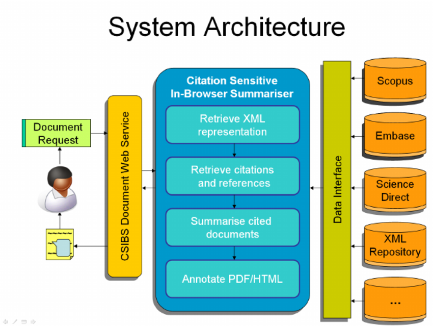

---
 
# Architecture
 
Understand the structure of the Dummy Project.
 
## 🧱 Components
 
1. Frontend
2. Backend
3. Documentation
 
## 🧭 System Diagram
 

 
## 🧮 Module Table
 
| Module     | Language | Purpose         |
|------------|----------|-----------------|
| UI         | HTML/CSS | User Interface  |
| API        | Python   | Business Logic  |
| Docs       | Markdown | Documentation   |

